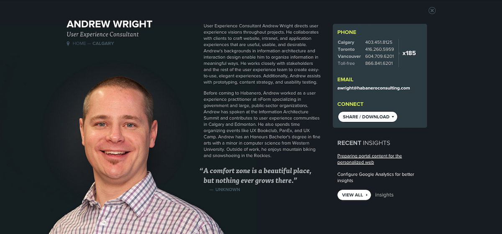

In a recent workshop with [Jeff Eaton](http://twitter.com/eaton) of [Lullabot](http://www.lullabot.com/), he was sharing his thoughts on "[Modeling rich narrative content](http://www.slideshare.net/eaton/modeling-rich-narrative-content)" and how structured content creates better experiences for readers, gives more (of the right kind of) control to authors, and helps content extend its reach. These concepts have their roots in the content strategy conversations about "[Create once, publish everywhere](http://www.programmableweb.com/news/cope-create-once-publish-everywhere/2009/10/13)", Nimble content, and Adaptive content.

During the section of the workshop on content modeling, Jeff was walking through the steps of "breaking down re-usable components, and figuring out how to work with them." The first step totally surprised me. He said that for each content component we're designing we need to ask: **[What's its job?](http://www.slideshare.net/eaton/modeling-rich-narrative-content/91?src=clipshare)**.

<!--iframe src="//www.slideshare.net/slideshow/embed_code/key/mtx0M1y6wNHob1?startSlide=90" width="595" height="485" frameborder="0" marginwidth="0" marginheight="0" scrolling="no" style="border:1px solid #CCC; border-width:1px; margin-bottom:5px; max-width: 100%;" allowfullscreen> </iframe> <div style="margin-bottom:5px"> <strong> <a href="//www.slideshare.net/eaton/modeling-rich-narrative-content" title="Modeling Rich Narrative Content" target="_blank">Modeling Rich Narrative Content</a> </strong> from <strong><a href="//www.slideshare.net/eaton" target="_blank">Jeff Eaton</a></strong> </div-->

Now, I realize that asking this kind of question _should_ be obvious to a content strategist like you or me since we're constantly asking "why?" and trying to understand the purpose of each piece of content. So why was I so surprised and excited by this?

## Jobs are simple and familiar

The language that Jeff Eaton used that really clicked: **job**. It's simple and it captures so much of what I'm often struggling to explain to people. Anyone can relate to a job and how to describe it. That's the beauty of it.

Ask [Wikipedia](https://en.wikipedia.org/wiki/Job) what a job is and you get this:

> A _person's_ job is their role in _society_. 

If you take this snippet and apply it to content modeling you might get something like this:

> A _content component's_ job is its role on the _website_.

This simple idea can be easily incorporated into your modeling activities. To describe a content component's job, start with this simple MadLib.

```
The job of a __________ is to __________.
```

The first blank is the _content component_ and the second blank is the _job description_.


### Example: the job of a staff bio

[](../assets/img/content-jobs/habanero-bio-2x.png)

I work at [Habanero](http://www.habaneroconsulting.com) and every staff member has a bio on our website. Here's [mine](http://www.habaneroconsulting.com/team/andrew-wright).

Applying the MadLib format, from above, to a Habanero staff bio, you get something like this:

> The job of a ...**staff bio**... is to ...promote a staff member's expertise and personality to (potential) clients.

Simple, right?

You could stop there and have defined a clear purpose for this content component on the website. You could then use this "job description" throughout a design project, during training, during an audit, etc. to have conversations about the value and intent of the staff bio component.

Depending on your needs, you could take it a step further and describe the jobs of the smaller components of a staff bio, as well.

<table class="table table-condensed table-striped">
	<thead>
	<tr>
		<th>Content component</th>
		<th>Job description</th>
	</tr>
	</thead>
	<tbody>
		<tr>
			<td>Location<br/>(home base)</td>
			<td>let people know which of our 3 offices this employee works in</td>
		</tr>
		<tr>
			<td>Photo</td>
			<td>help (potential) clients recognize our employees so they can "put a face to a name" or "put a name to a face"</td>
		</tr>
		<tr>
			<td>Bio blurb</td>
			<td>share each person's work and education story – peppered with some individual character</td>
		</tr>
		<tr>
			<td>Quote</td>
			<td>to have some fun and get to know this person more</td>
		</tr>
		<tr>
			<td>Contact info</td>
			<td>make it easy to reach this person</td>
		</tr>
		<tr>
			<td>Recent insights</td>
			<td>further demonstrate this person's expertise and interests</td>
		</tr>
	</tbody>
</table>

## Ask better questions

Thinking about the job of each content component encourages you to ask and answer different questions because each content component on a website plays a different role and has a different job description.

When **planning content** components, you'll ask:

- How would I describe the job of this content component?
- How does this content component's job relate to our web strategy?
- Does our website and our business actually need this job to be done?

When **crafting content** or **reviewing content** on your website, you'll ask:

- Which content components should I use on this page to achieve my messaging goals?
- Is this content component doing its job well? How could it improve?

## Benefits of describing jobs

Fine. But why should I go to all of the trouble of describing jobs for each content component when I've already got so much to do?

The immediate benefits of understanding the job of each content component are that it:

1. generates **better conversations** during the design process,
2. creates a **shared understanding** around content functions, and
3. helps authors make **thoughtful and informed decisions** when it comes to crafting new content.


## Summary

Every piece of content on your website has a job to do. The idea of a job is simple and familiar so adding "content jobs" to your language will be well-received and readily understood by others. Job descriptions follow a simple format and help you ask better questions of the content you create and review. With job descriptions as your frame of reference, you and your team will be positions to have better conversations and to make informed content decisions.

Oh, and content that doesn't have a clear job should either get one or get out. ;)