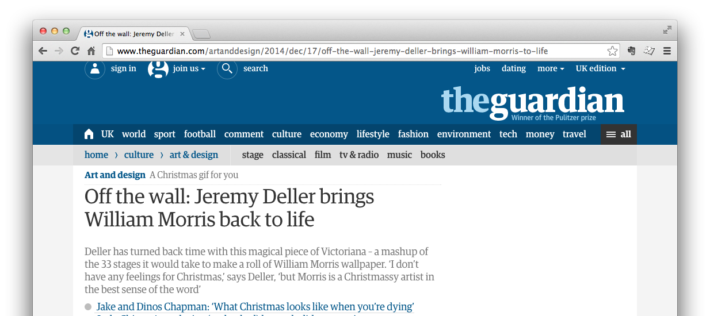
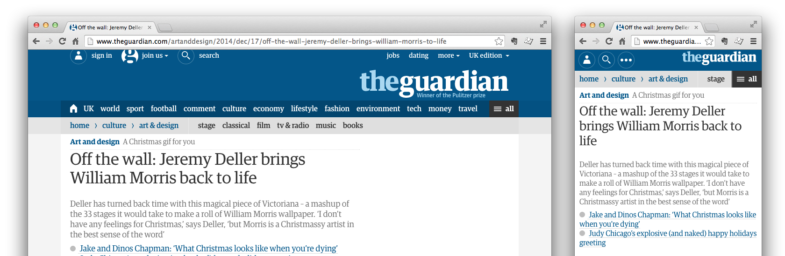
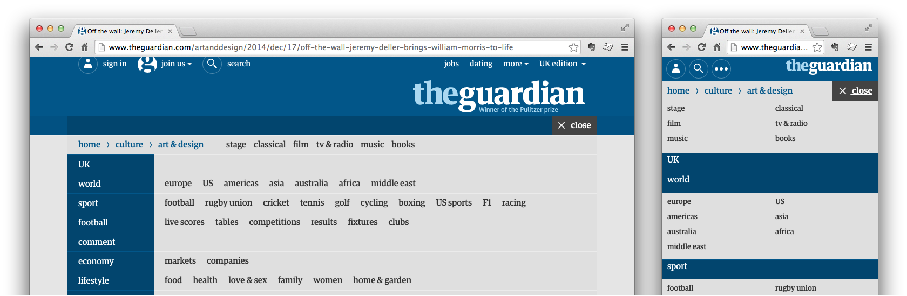
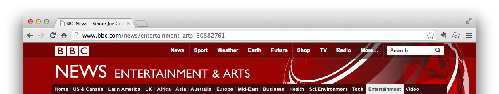
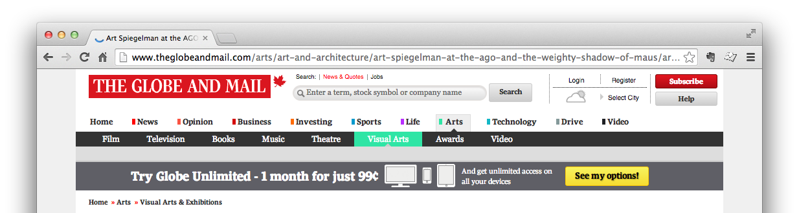
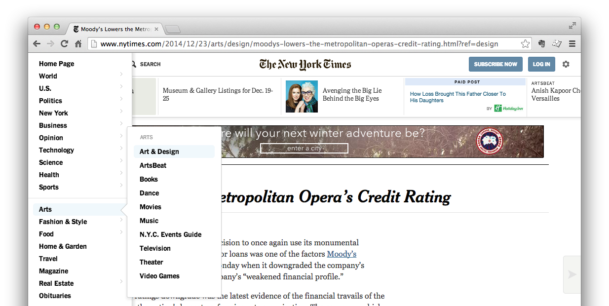
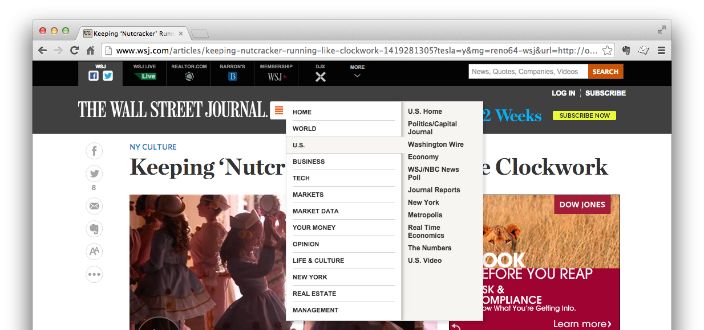

Designing good navigation is hard. Often there is a complex hierarchy at play with many sections and many levels. The information architect's goal is to hide the complexity.

Navigation that responds well to the growing number of device/viewport combinations is even harder to do well. Information architects and interaction designers team up to hide the complexity whilst exposing as much relevant information as possible with minimal user interactions.

## The Guardian

British newspaper [The Guardian](http://www.theguardian.com/) (beta) has employed an interesting pattern to handle the complexity of their navigation across devices and viewport sizes. It's awesome because it follows these principles:

1. Use simple, distinct labels &rarr; _"I understand what's here."_
2. Provide signposts for wayfinding and context &rarr; _"I know where I am."_
3. Show as much useful navigation as possible &rarr; _"I know where I can go."_
4. Expect minimal user interactions &rarr; _"I know what I have to do."_

What's different about the Guardian's approach is that they package these features together in a tidy, efficient space that feels more welcoming and usable than any news-site navigation I've come across before. And all of this is done without the design feeling cluttered or confusing.

The Guardian navigation (normal) &mdash; click to enlarge

The Guardian navigation (sitemap) &mdash; click to enlarge

## Navigation areas

Labelling the navigation areas reveals the structure:

- "global" navigation pointing to top-level sections,
- "breadcrumb" navigation showing signposts to the current section,
- "neighbour" sections revealing local navigation.

The Guardian navigation labelled with purpose &mdash; click to enlarge

The Guardian navigation labelled with purpose on mobile &mdash; click to enlarge

### Global navigation

The global navigation (including top-level sections) spans the width of the container to maximize the available space for displaying menu items. Labels are kept short (at 1 or 2 words in length) and spacing is just enough to identify each label as unique.

Side-scrolling navigation on mobile

At smaller viewport sizes, the global navigation is kept in-line and can be scrolled horizontally. It is demoted in priority in favour of keeping the breadcrumb and local navigation visible.

### Breadcrumb navigation

The breadcrumb shows the path from home to the current section but doesn't include the current page title. This keeps it short and sweet, again, like the global navigation. It provides context for your current location and sets the tone for a great navigational addition: the neighbouring sections.

### Neighbouring sections (local) navigation

Neighbours of the current section are revealed in the context of the breadbrumb to create something of a local navigation. Revealing the neighbouring sections in this way is an efficient use of space that makes exploration easy and adds richness to the navigation experience without adding complexity to understanding.

### All sections (sitemap) navigation

The Guardian has made an interesting choice to include the "hamburger" navigation for all viewport sizes; resulting in:

- the structure of the website being revealed;
- simple, efficient presentation of the structure across devices;
- a better experience than the global navigation on small devices.

The "all sections' navigation is the better go-to navigation on smaller devices and is better relegated to a supporting role on larger ones. Plus, a nice responsive labelling feature is included: the "all sections" label for large viewports reduces to just "all" (plus the "hamburger" icon) for smaller viewports.

## Still not convinced?

Just in case you weren't convinced of how great the Guardian's new navigation is, compare it to these other online news sources.

BBC News - Entertainment article &mdash; click to enlarge

The Globe and Mail - Visual Arts article &mdash; click to enlarge

NY Times - Art & Design article &mdash; click to enlarge

WSJ Online - Entertainment article... I think &mdash; click to enlarge

<table class="table table-condensed table-striped">
	<thead>
	<tr>
		<th>&nbsp;</th>
		<th class="text-center">Guardian</th>
		<th class="text-center">BBC</th>
		<th class="text-center">Globe and Mail</th>
		<th class="text-center">NY Times</th>
		<th class="text-center">WSJ</th>
	</tr>
	</thead>
	<tbody>
		<tr>
			<th>Use simple labels</th>
			<td class="text-center">x</td>
			<td class="text-center">x</td>
			<td class="text-center">x</td>
			<td class="text-center">x</td>
			<td class="text-center"></td>
		</tr>
		<tr>
		<th>Provide signposts</th>
			<td class="text-center">x</td>
			<td class="text-center"></td>
			<td class="text-center">x</td>
			<td class="text-center"></td>
			<td class="text-center"></td>
		</tr>
		<tr>
		<th>Show most navigation</th>
			<td class="text-center">x</td>
			<td class="text-center"></td>
			<td class="text-center">x</td>
			<td class="text-center"></td>
			<td class="text-center"></td>
		</tr>
		<tr>
		<th>Minimal interaction</th>
			<td class="text-center">x</td>
			<td class="text-center">x</td>
			<td class="text-center">x</td>
			<td class="text-center"></td>
			<td class="text-center"></td>
		</tr>
		<tr>
			<th>Efficient presentation</th>
			<td class="text-center">x</td>
			<td class="text-center">x</td>
			<td class="text-center"></td>
			<td class="text-center">x</td>
			<td class="text-center"></td>
		</tr>
	</tbody>
</table>

As you can see, other news-sites _hide the navigation_ in "hamburgers," _over-stylize and encode the navigation_, or _fail to provide any clear navigation at all_ (I'm looking at you WSJ).

## Summary

The navigation patterns introduced in the Guardian (beta) re-design makes efficient use of space for all viewport sizes, it does a good job of reprioritizing navigation based on context, and it provides clear labels and understandable design which deliver a simple, easy to use navigation experience.