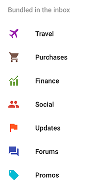
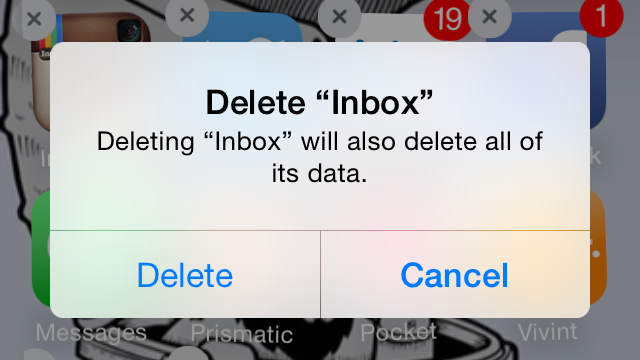

[")](http://www.google.com/inbox/)

## We have expectations when it comes to email.

From years of using different emails applications (Gmail, Outlook, and sometimes Mail), I've come to expect a few things of my email application. I expect that I can sort through the mail in my inbox and decide which message to read and which to throw-out. I expect that I can "flag" or "star" a message that I want to read later or take action on. I expect that I can declutter my inbox by filing messages into tag groups or folders. I also expect my email to pile up in the order it arrives (at least by default, anyway).

I don't think that's a lot to ask.

## Google Inbox doesn't meet expectations.

Somehow, [Google Inbox](http://www.google.com/inbox/) fails to deliver on these expectations. This is surprising given the number of years that Google has been in the email business. I mean, the name "Google Inbox" implies that there's an inbox where new mail piles up but there are actually 7 inboxes (which are called "Bundles").

Now, before I go to far with this, I appreciate what Google's trying to do here. The idea of grouping and organizing similar types of messages is nothing new to me. I'm an information architect and I have over 30 of my own tags / folders set up in my Gmail account  to organize and classify the messages I keep (including annual archives for easy findability). I thought I was going to love the concept of Bundling.

Bundling in the inbox is exactly the reason my expectations haven't been met.

## Seven inboxes are not better than one.

Because of bundling, I can no longer scan my "inbox" quickly to read or discard messages. Messages classified as _Travel_, _Purchases_, _Finance_, _Social_, _Updates_, _Forums_, or _Promos_ are bundled up and buried behind another layer of navigation – effectively hidden from view. This makes it seem like there are fewer things in my inbox but goes against the whole point of an inbox which, I believe, is to see the messages there.

### The Pinning metaphor just doesn't work for me.

Google Inbox introduced the idea of "pinning" messages in your inbox. The problem with the "pin" metaphor is that I think of a cork board that I pin something to and that thing remains fixed in place. Pinning a message in the Inbox doesn't have that effect. Pinning is similar to "starring" a message in Gmail or "flagging" in Outlook. Like these other concepts, pinning is a simple earmarking technique used to find important messages later.

### Time is a useful search criteria.

Time is disrupted in the Google Inbox. Technically, messages are clustered based on their arrival into groupings like: _Today_, _Yesterday_, _This month_, _January_, etc. but bundling upsets the chronological presentation by prioritizing the topic or theme of a message over the order of arrival. This is confusing because a bundle, like "Purchases," will jump around in your inbox based on when the last purchase-related message arrived. This unpredictable experience makes Inbox annoying and, at times, frustrating.

### Organize or die.

At least Google Inbox still let's me move messages out of the inbox and into folders. Phew.

## Google Inbox got a few things right.

It did have some highlights and small wins that deserve to be acknowledged. (Even if they weren't big enough to overcome the absence of the basics.)

Inbox surfaces attachments, appointments, updates, and actions in-line with messages making them more accessible than they have been in the past, (Not having to click into the message to open the attachment can be a nice time-saver.) However, this is only useful when the message shows up in a predictable way within the stream.

Built in task management picks up on the emergent behaviour of people using inboxes as to-do lists. When pinning a message, you can add a reminder to it so you know what you need to do with it later. To defer action on a message, you can "snooze" it until a later time and it will re-appear in your inbox then. Once you've dealt with a message, check it off to remove it from your inbox (and archive it like in Gmail).

## Summary

Google Inbox comes with a couple highlights and is challenging the way we use email. There are some really curious concepts that are worth exploring further and that others may wish to experiment with. But, I'm so disappointed in the basic experience of using Google Inbox for email that I'm deleting the app. Now.

