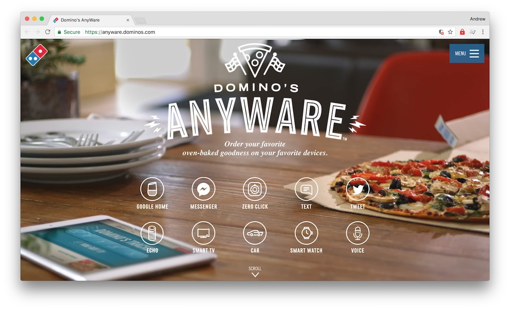

## [Design in the era of the algorithm](https://bigmedium.com/speaking/design-in-the-era-of-the-algorithm.html)
_By **[Josh Clark](https://bigmedium.com/about/josh-clark.html)** of [Big Medium](https://bigmedium.com/)_

> **What shall we make?** This talk is about what's coming next for us as designers. What's the work ahead for us, and what's our role and responsibility in this future?

Josh Clark touches on the trends around next-gen mobile, conversational UI, machine learning, and algorithms; and there impacts on what we design.

Here are [Josh's ten design principles](https://bigmedium.com/speaking/design-in-the-era-of-the-algorithm.html#productivehumilityformachine-generatedinterfaces) for conceiving, designing, and managing data-driven products.

1. Favor accuracy over speed
1. Allow for ambiguity
1. Add human judgment
1. Advocate sunshine
1. Embrace multiple systems
1. Make it easy to contribute (accurate) data
1. Root out bias and bad assumptions
1. Give people control over their data
1. Be loyal to the user
1. Take responsibility

The article is a summary of the talk he gave at [Pixel Up!](https://pixelup.co.za/) and I suggest you [download the slides](../assets/docs/design-in-the-era-of-the-algorithm.pdf), too. They're worth it.

## [Domino's Anyware App](https://anyware.dominos.com/)

HFS. Domino's is trying every channel and medium available to make ordering pizza the simplest thing ever! (Except for maybe choosing which channel to use!)

[https://anyware.dominos.com/](https://anyware.dominos.com/)

Note: Domino's Anyware is one of the examples offered up in Josh Clark's post, above.

## [Empathy’s Role in Experience Design](http://uxmag.com/articles/empathy%E2%80%99s-role-in-experience-design)

_By **[Jen Briselli](http://uxmag.com/readers/jen-briselli)** of [Mad*Pow](http://madpow.com/)_

Jen Briselli explains why empathy needs to remain in the designer's toolkit and not just become a relic of over-hyped terms.

She highlights two great points:
1. Affective empathy is not the same as cognitive empathy and, as designers, we need to select accordingly for our design process.
2. Design is evolving to be more collaborative with our "users".

### On cognitive versus affective empathy
> "There is a difference between **cognitive empathy** (the capacity to understand another’s mental state), and **affective empathy** (feeling and responding to another’s emotional state)."

### On the evolution of design and empathy's role

> As design evolves, the role of empathy will evolve with it.

##### Before

> "Let me understand how this looks and feels to you... now let me solve this problem for you by pretending to be you and layering my design skills on top to solve it."

##### Current transition

> "Let me understand how this looks and feels to you... and now let me use that understanding to build tools with you so you can solve that problem any time."

##### Future

Eliminates the differentiation between me/designer and you/designee.

> "Let me understand how this looks and feels to you... and you can understand how it looks and feels to me, and we'll design something together toward a shared vision."

- - - - -

What should I read next week? [Tell me on Twitter](http://twitter.com/andrewjwright).
